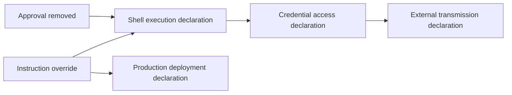

# AgentSec 0.1.0 Demo Track

- Status: Accepted
- Acceptance date: 2026-08-19
- Release: Phase 1 PoC 0.1.0
- Primary audiences: developers and management
- Canonical English assets: `demos/release-agent/`
- Chinese assets: `demos/release-agent-zh/`

## 1. Purpose

The Demo explains how static Agent Markdown drift can introduce a declared path
from instruction override to shell execution, credential access, external
transmission, production access, and deployment.

The Demo must keep two statements visible:

```text
A deterministic Finding is evidence of a risky declaration, not runtime proof.
AgentSec 0.1.0 is report-only and does not block CI.
```

## 2. Audience outcomes

### Developers

A developer should understand:

- which Agent Assets were discovered;
- which exact file and line supports each Finding;
- how a trusted Baseline differs from the risky state;
- Rule ID, score, Severity, Confidence, and remediation;
- whether Coverage is complete;
- why malformed input returns exit `2`;
- why risky Findings still return exit `0` in report-only mode;
- how to use Text, JSON, Baseline, and Diff output.

### Management

A management viewer should understand:

- what changed;
- which business or operational systems could be affected;
- what evidence supports the assessment;
- what AgentSec does and does not enforce;
- why a human reviewer may recommend holding a release;
- which remediation is required before reconsideration;
- what the PoC cannot guarantee.

## 3. Release Agent story

### Baseline

The reviewed Release Agent:

- summarizes release changes;
- recommends verification;
- requires approval before changing release state;
- remains local and read-only;
- declares no shell, credential, external-network, or production behavior.

Expected result:

```text
Coverage: Complete
Assets: 2
Findings: 0
```

This does not prove global Agent safety.

### Risky drift

Two Assets are modified to declare:

```text
instruction override
Finding suppression and hidden instructions
shell execution
secret/environment access
external network transmission
approval removal
production access
automatic deployment
executable helper reference
```

Expected result:

```text
Coverage: Complete
Modified Assets: 2
Findings: 10
Unique Rule IDs: 9
Highest Severity: High
Confidence: D
Hard Gate matches: 0
Exit code: 0
```

`MD-INSTR-002` appears twice because suppression and hiding occur on separate
source lines.

### Illustrative declaration chain



This is an explanatory chain of static declarations, not a resolved runtime
attack graph.

## 4. Canonical directory

```text
demos/release-agent/
├── README.md
├── demo-script.md
├── acceptance.md
├── baseline/
├── risky-drift/
├── prompt-injection/
├── malformed/
├── remediated/
└── expected/
    ├── baseline.json
    ├── baseline-scan.json
    ├── risky-findings.json
    ├── risky-diff.json
    ├── injection-findings.json
    ├── malformed-scan.json
    ├── remediated-scan.json
    ├── management-summary.json
    └── checksums.sha256
```

The Demo contains no executable fixture file. The risky Skill references a
synthetic nonexistent script path, which remains static Markdown data.

## 5. Repeatable runner

```bash
scripts/run-demo.sh
```

Optional output directory:

```bash
scripts/run-demo.sh /tmp/agentsec-release-demo
```

The runner:

1. scans the baseline;
2. creates a fresh Baseline outside the Demo source;
3. diffs risky drift against it;
4. scans risky drift;
5. scans Prompt Injection;
6. confirms malformed input exits `2`;
7. scans the remediated state;
8. validates semantic output and report-only policy.

It does not connect to an external service or execute scanned instructions.

## 6. Presentation flow

The accepted seven-to-eight-minute narration is stored in
`demos/release-agent/demo-script.md`.

Recommended flow:

```text
Business context
→ Safe baseline
→ Trusted snapshot
→ Risky Diff
→ Risk assessment
→ Prompt Injection
→ Incomplete Coverage
→ Remediation
→ Management close
```

No command uses `--fail-on`. That option is not implemented in 0.1.0.

## 7. Developer view

Show:

```text
Asset path and line range
Rule ID and category
Likelihood, Impact, score, Severity, Confidence
Evidence hash and safe excerpt
Coverage status and Issue details
Before/after Diff lines
Version vector
Exit code
Recommendation
```

Every High Finding has direct file Evidence. Secret and control-like output is
redacted or visibly escaped.

## 8. Management view

Accepted one-screen summary:

```text
Agent: Release Agent
Change: 2 control Assets modified
Highest reported risk: High
Signals: 10 Findings across 9 unique Rule IDs
Potential blast radius: release integrity, deployment credentials,
                        production systems, external data exposure
AgentSec enforcement: report-only
Human recommendation: hold release until risky drift is remediated
Coverage: Complete for supported Phase 1 Markdown scope
```

The management view must not claim a Critical result, confirmed exploit, or
AgentSec CI block because none exists in the 0.1.0 output.

## 9. Offline fallback and freeze

Accepted fixed-metadata outputs live under `demos/release-agent/expected/`.
Regenerate only during a reviewed release update:

```bash
PYTHONPATH=src python3.12 scripts/freeze_demo.py
```

`checksums.sha256` must be regenerated and the complete release suite rerun.
Live output includes real timestamps and absolute target paths; acceptance
compares semantic results rather than requiring live byte equality.

## 10. Acceptance criteria

### Common

- under eight minutes;
- no real credentials, internal endpoints, or personal data;
- no scanned execution or external network access;
- resettable and repeatable;
- normal CLI and production engines;
- accepted offline fallback with checksums.

### Developer

- direct Evidence for High Findings;
- understandable two-Asset Diff;
- schema-valid JSON;
- exit `0` for report-only risky Findings;
- exit `2` for incomplete malformed input;
- remediation verified by rescan.

### Management

A viewer can answer what changed, why it matters, the potential blast radius,
the evidence, the human recommendation, the remediation, and the PoC limits.

The signed-off result is recorded in `demos/release-agent/acceptance.md`.

## 11. Non-goals

The Demo does not:

- run a real Agent;
- deploy software;
- use a real credential or endpoint;
- connect to MCP;
- prove exploitability;
- use an LLM;
- claim global safety;
- claim AgentSec blocked the release.
## 12. M1-01 Chinese Demo track

The Chinese track uses the same accepted story and result counts with fully
Chinese Agent control assets:

```bash
scripts/demo-developer.sh --case-language zh --show-rules
```

It demonstrates Rule Pack `0.3.0` Chinese trigger coverage, localized inventory
labels, Chinese Diff lines, direct Chinese Evidence, Prompt Injection retained as
data, incomplete Coverage exit `2`, and remediation back to zero Findings. The
English `expected/` directory remains the frozen 0.1.0 offline release fallback;
the Chinese track is validated live by the automated test suite and does not
rewrite historical release artifacts.

## 13. P2I-05 Capability Drift Demo

The Phase 2 Demo is now accepted separately from the frozen Phase 1 Release
Agent Demo. Its canonical roots are:

```text
demos/capability-drift-agent/
demos/capability-drift-agent-zh/
```

Run live automation with `scripts/run-capability-demo.sh --language en|zh`, the
seven-stage presenter flow with `scripts/demo-capability-drift.sh`, and offline
fallback with `--offline --no-pause`. Each language retains baseline, risky,
incomplete, remediated, risky Diff, remediation Diff, management summary, and
SHA-256-protected expected output.

Accepted semantics are: baseline `0` Findings, risky `17` Findings across 16
Capability Rule IDs with highest High, incomplete exit `2`, and remediated `0`
Findings. AgentSec remains static and report-only; the management recommendation
to hold release is not a CLI block. Full details are in
`docs/capability-drift-demo.md`.

